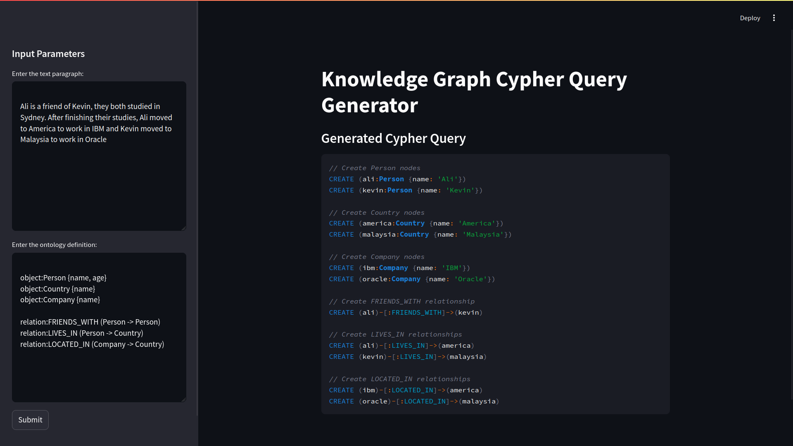

# Demo: Extracting Structured Knowledge Graph From Unstructured Document Using LLM and Graph Database

## Introduction

This is a streamlit application demonstrating the use of LLM to generate cypher query
supported by ontology to populate a knowledge graph.



## Running

Make sure you have `uv` (https://docs.astral.sh/uv/) installed

```bash
export OPENAI_API_KEY=<YOUR_API_KEY>
uv sync
uv run streamlit run app.py
```


